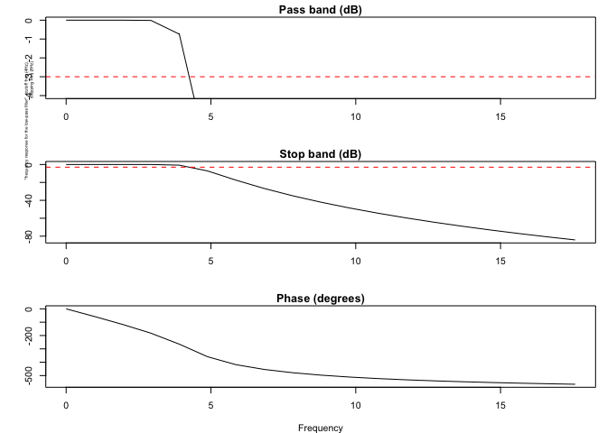
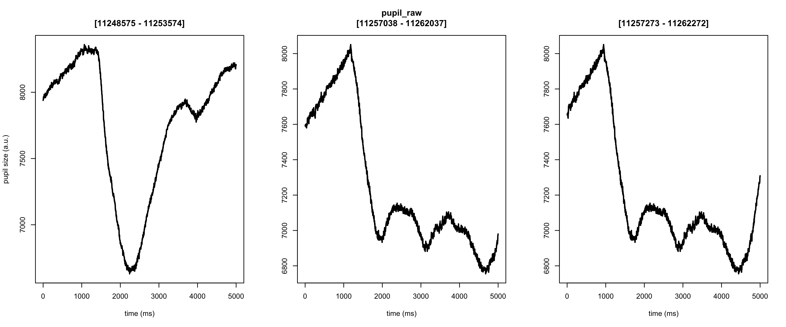
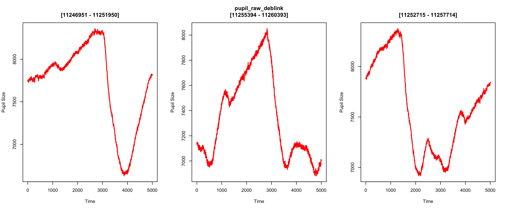
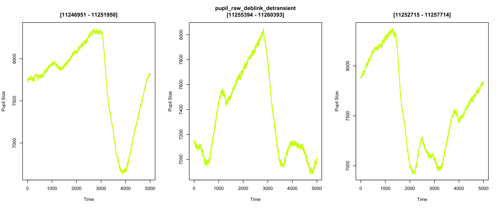
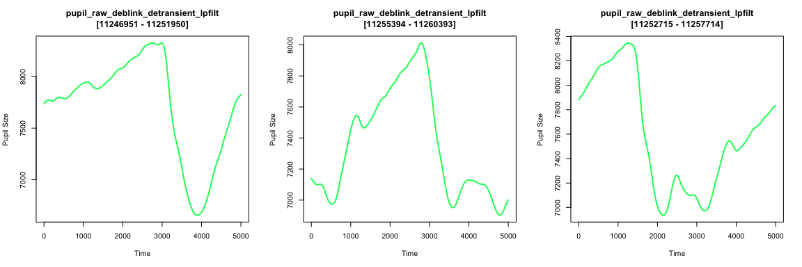
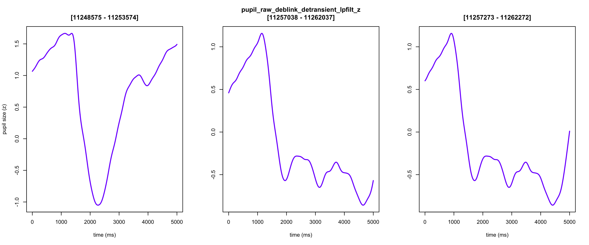
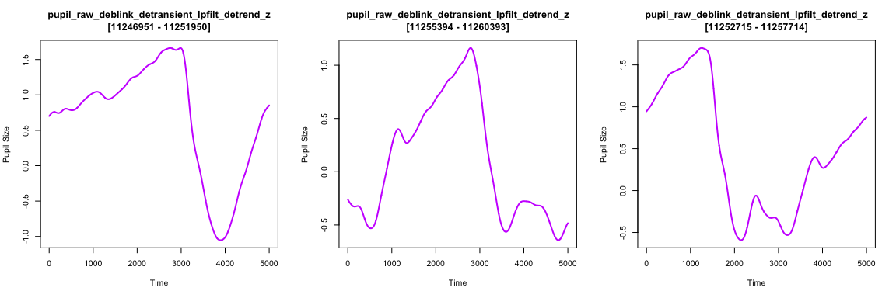
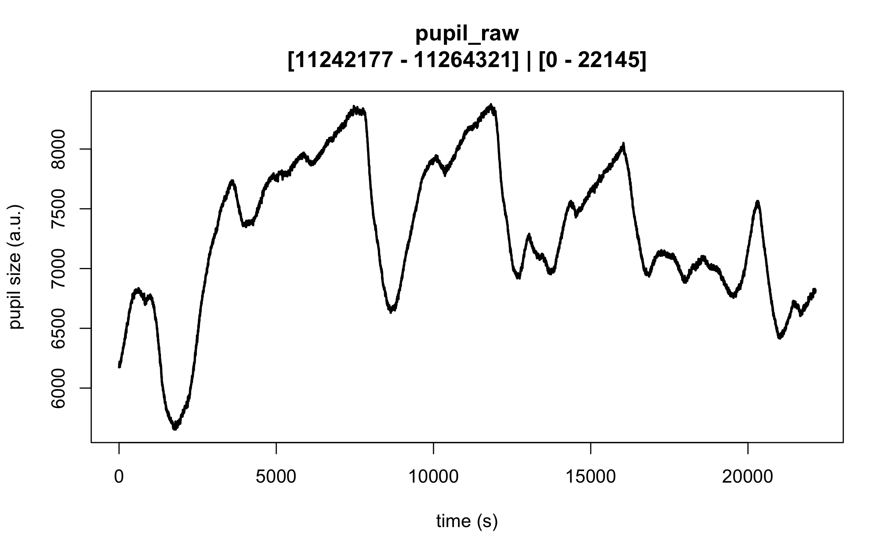
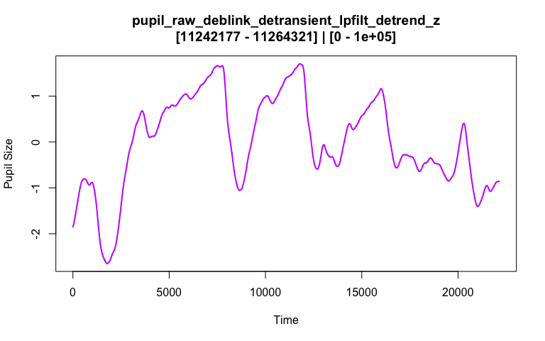

<!-- README.md is generated from README.Rmd-->

# `eyeris`: flexible reproducible pupil preprocessing pipelines in R <a href="http://shawnschwartz.com/eyeris/" title="eyeris website"></a>

<!-- badges: start -->

<a href="LICENSE.md" alt="MIT License"></a>
<a href="https://github.com/shawntz/eyeris/actions/workflows/build.yml/badge.svg" alt="R Package Build Status"></a>
<a href="https://github.com/shawntz/eyeris/actions/workflows/linter.yml/badge.svg" alt="R Package Linter Status"></a>
<!-- badges: end -->

<!-- The goal of eyeris is to ... -->

## Installation

You can install the development version of eyeris from
[GitHub](https://github.com/) with:

``` r
# install.packages("devtools")
devtools::install_github("shawntz/eyeris")
```

or

``` r
# install.packages("pak")
pak::pak("shawntz/eyeris")
```

## Example

### the `glassbox()` “prescription” function

This is a basic example of how to use `eyeris` out of the box with our
very *opinionated* set of steps and parameters that one should start out
with when preprocessing pupillometry data. Critically, this is a
“glassbox” – as opposed to a “blackbox” – since each step and parameter
implemented herein is fully open and accessible to you. We designed each
pipeline step / function to be like legos – they are intentionally and
carefully designed in a way that allows you to flexibly construct and
compare different pipelines.

We hope you enjoy! -shawn

``` r
set.seed(32)

library(eyeris)

demo_data <- system.file("extdata", "memory.asc", package = "eyeris")

eyeris_preproc <- glassbox(
  demo_data,
  detrend_data = F,
  lpfilt = list(plot_freqz = T)
)
#> ✔ [  OK  ] - Running eyeris::load_asc()
#> ✔ [  OK  ] - Running eyeris::deblink()
#> ✔ [  OK  ] - Running eyeris::detransient()
#> ✔ [  OK  ] - Running eyeris::interpolate()
#> ✔ [  OK  ] - Running eyeris::lpfilt()
#> ✔ [  OK  ] - Skipping eyeris::detrend()
#> ✔ [  OK  ] - Running eyeris::zscore()
```



### step-wise correction of pupillary signal

``` r
plot(eyeris_preproc)
```



### final pre-post correction of pupillary signal (raw ➡ preprocessed)

``` r
plot(eyeris_preproc,
     steps = c(1, 5),
     preview_window = c(0, nrow(eyeris_preproc$timeseries)))
```



------------------------------------------------------------------------

# Comments, suggestions, questions, issues?

Please use the issues tab (<https://github.com/shawntz/eyeris/issues>)
to make note of any bugs, comments, suggestions, feedback, etc… all are
welcomed and appreciated, thanks!
